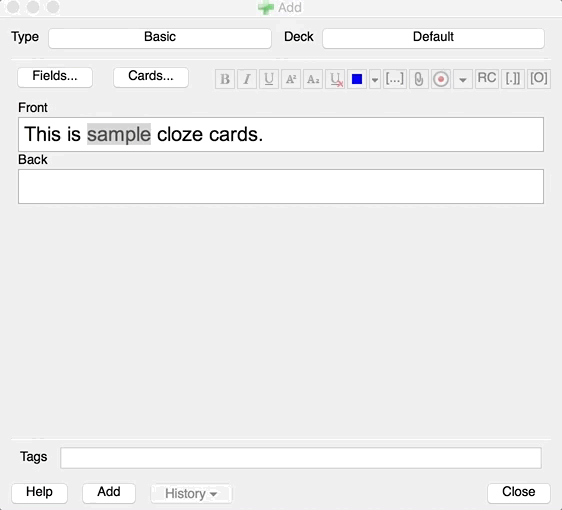
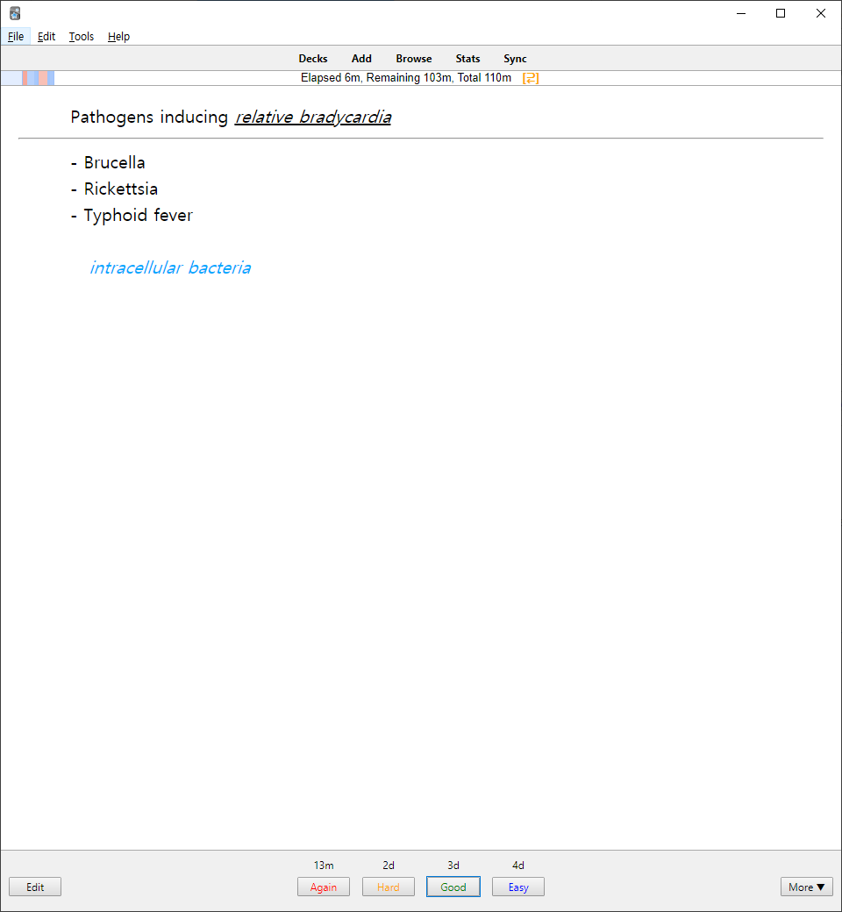
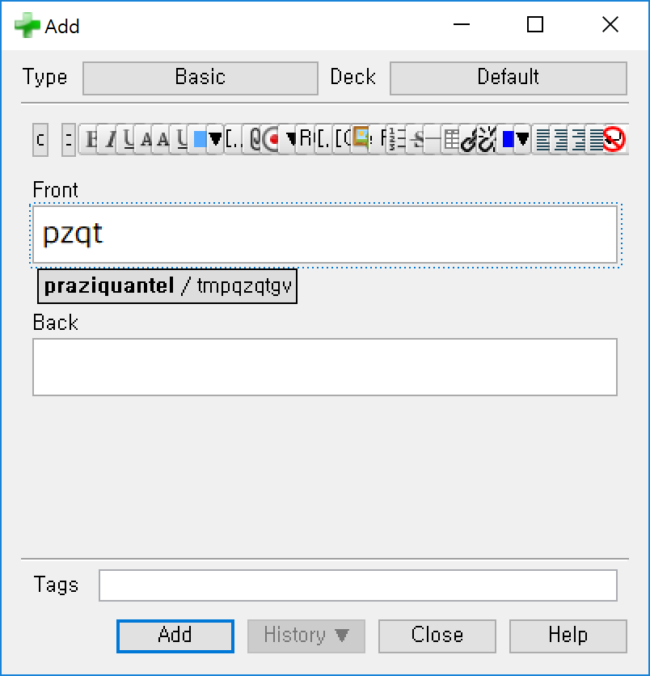

# anki_plugins 

Some useful plugins for anki. If you find these plugins useful, feel free to donate via paypal.

## Automatic switch from Basic to Cloze

[AnkiWeb page](https://ankiweb.net/shared/info/2105427255)

This plugin prevents you from creating Cloze note in basic note types. If you try to do so, this plugin just automatically changes the note type to Cloze. So you can make both cloze type and basic type note via Basic note type.

## Cloze (Hide all)

[AnkiWeb page](https://ankiweb.net/shared/info/1709973686)

This addon creates a new card type. On this card type, all clozes except what you're reviewing now are hidden with a yellow box.

## Remaining Time

[AnkiWeb page](https://ankiweb.net/shared/info/1508357010)

Shows you a remaining time to complete a deck. Essential addon.

## Word autocompleter (Anki 2.0)

[AnkiWeb page](https://ankiweb.net/shared/info/1299759105)

This adds sublime text-like fuzzy word autocompletion to anki.

## Obsolete addons

- IME caret fixer: Deprecated as of Anki 2.1
- Paste HTML: Anki 2.1 has native support of pasting formatted data.
